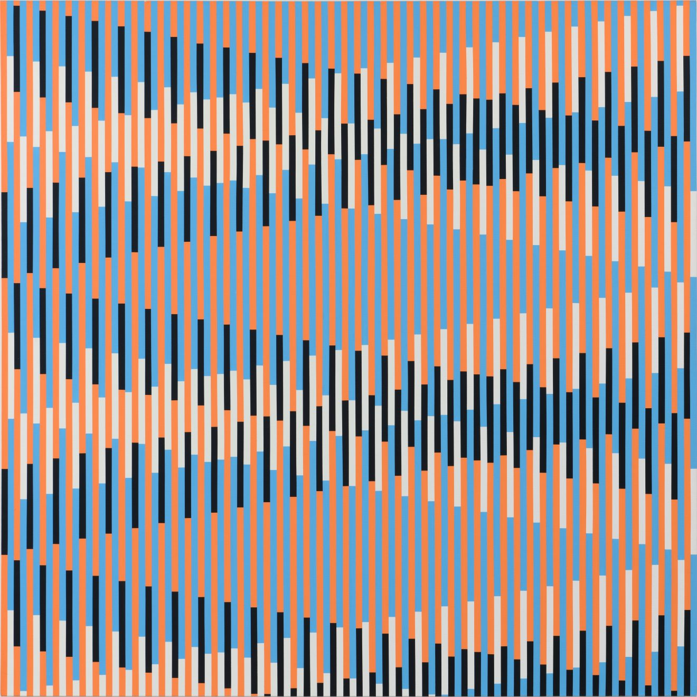

# Patterns projections

Artwork by [Horst Bartnig](https://de.wikipedia.org/wiki/Horst_Bartnig)

This course focuses on patterns composition and projection on surfaces using shaders and openFrameworks.

*Requirements:*

- A working installation of openFrameworks >= to 0.10.1.
- These [ofxAutoReloadedShader](https://github.com/andreasmuller/ofxAutoReloadedShader) and [ofxGLWarper](https://github.com/roymacdonald/ofxGLWarper) in your `addons` folder. 

##### Table of Contents

[Intro to the course, 17/04](#intro-to-the-course)

[Functions and colors, 24/04](#functions-and-colors)

[Shapes and signed distance function, 08/05](#shapes-and-signed-distance-function)

[Matrices and Patterns, 22/05](#matrices-and-patterns)

[Audioreactive, 5/06](#audioreactive) 

[Final project pt. 1, 19/06](#final-project-pt1)

[Final project pt. 2, 26/06](#final-project-pt2)

<a name="#intro-to-the-course">

## Intro to the course

</a>

- Goals of the course
- Example of works
- What is a shader, make your first one.

### Resources/Inspiration

- Chapter [1](https://thebookofshaders.com/01/), [2](https://thebookofshaders.com/02/) and [3](https://thebookofshaders.com/03/) of "The Book of Shader".
- How to run your shader on different [platforms](https://thebookofshaders.com/04/)

- [Horst Bartnig](https://www.google.com/search?q=horst+bartnig+patterns)
- [Frieder Nake](https://www.google.com/search?q=Frieder+Nake+patterns)
- [Gerard Richter](https://www.google.com/search?q=gerhard+richter+patterns)
- [Mark Wilson](https://www.google.com/search?q=Mark+Wilson+patterns)
- [Anni Albers](https://www.google.com/search?q=anni+albers)
- [Joan Truckenbrod](https://www.google.com/search?q=Joan+Truckenbrod+patterns)
- [Channe Horwitz](https://www.google.com/search?biw=1536&bih=754&tbm=isch&sa=1&ei=v6zeXJO2H8eQrgTR1rko&q=Channa+Horwitz+patterns)
- [Daniel Buren](https://www.google.com/search?q=Daniel+Buren+patterns)
- [Sara Morris](https://www.google.com/search?hl=en&source=hp&ei=mWqnXJ3zBcLjsAeIkrC4Bw&q=sarah+morris+pattern)
- [Vera Molnar](https://www.google.com/search?ei=IWOnXPm_GcOasAefhI5I&q=vera+molnar+patterns)
- [Carsten Nicolai](https://www.google.com/search?q=carsten+nicolai+patterns)
- [Ikeda pattern](https://www.google.com/search?biw=1024&bih=530&tbm=isch&sa=1&ei=NCPAXLSbKeWK1fAPxqiA4A8&q=ryoji+ikeda+pattern)
- [Casey Reas](http://reas.com/kttv/) and [Structure #003](https://artport.whitney.org/commissions/softwarestructures2016/s3_2/)
- [Saskia Freeke](http://sasj.tumblr.com/)
- [Leonardo Solas](http://solaas.com.ar/works/optic/optic.html)
- [Ettore Sottsass](https://www.google.com/search?q=ettore+sottsass+bacteria)
- [Archizoom](https://www.google.com/search?biw=1024&bih=530&tbm=isch&sa=1&ei=4BzAXOOwD4LRwQLN-ICYDQ&q=archizoom+patterns)
- [Ivan Serpa](https://www.google.com/search?q=Ivan+Serpa+patterns)

### Class Activities

- Your first shader

### Homework
- Find an artist working with pattern, collect 3/4 images of its work, you will show them in class the next lesson with your pattern.

<a name="#functions-and-colors">

## Functions and colors

</a>

- chapter [5](https://thebookofshaders.com/05/) and [6](https://thebookofshaders.com/06/)of "The Book of Shader".

### Resources/Inspiration

- Inigo Quiles [functions](http://www.iquilezles.org/www/articles/functions/functions.htm)

### Class Activities

- Frontal lesson

### Homework

- Make at least 4 sketches. You have to use these functions (they do not have to appear all in the same sketch): `sin`, `cos`, `tan`, `fract`, `step`, `smoothstep`, `mod`, `mix`, `pow` 
- Finish to read [chapter 6](https://thebookofshaders.com/06/)

<a name="#shapes-and-signed-distance-function">

## Shapes and signed distance function

</a>

### Resources/Inspiration

- Chapter [7](https://thebookofshaders.com/07/) and [8](https://thebookofshaders.com/08/)of the Book of Shaders.
- Hugh Kennedy [interactive tutorial](http://hughsk.io/fragment-foundry/chapters/07-distance-fields.html)
- Inigo's 2d distance function [reference page](https://www.iquilezles.org/www/articles/distfunctions2d/distfunctions2d.htm)

### Class Activities

### Homework
- Draw a form that combines several shapes.

<a name="#matrices-and-patterns">

## Matrices and Patterns

</a>

### Resources/Inspiration

- chapter [8](https://thebookofshaders.com/08/) and [9](https://thebookofshaders.com/09/) of the Book of Shaders.
- Multi-scale truchet patterns [1](http://archive.bridgesmathart.org/2018/bridges2018-39.pdf) and [2](https://christophercarlson.com/portfolio/multi-scale-truchet-patterns/).

### Class Activities

- Create your own pattern.

### Homework
- Create at least 2 patterns, one of those has to be a truchet pattern.
- Think about a fabric on which you would like to project your pattern, think about how to hang it to a wall, if you want to project on a wall. Think about how could you move it, if you want to move it.

<a name="#audioreactive">

## Audioreactive

</a>

### Class activities

- Finish truchet patterns
- Boolean operations see file BooleanOperation.frag
- 2D noise
- Make a copy of the OF app "template shader audio reactive".

### Resources/Inspiration

### Homework

- Make at least 5 audio reactive patterns.

### Extra

Have a look at:
- Rioji Ikeda [works](http://www.ryojiikeda.com/)
- Chapter [10](https://thebookofshaders.com/10/) and [11](https://thebookofshaders.com/11/) of the Book of shader.

<a name="#final-project-pt1">

## Final project pt.1

</a>

<a name="#final-project-pt2">

## Final project pt.2

</a>

